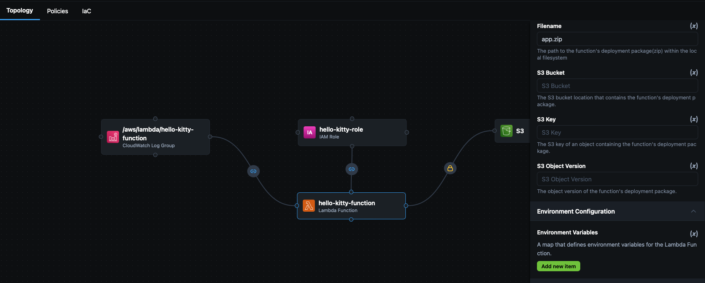
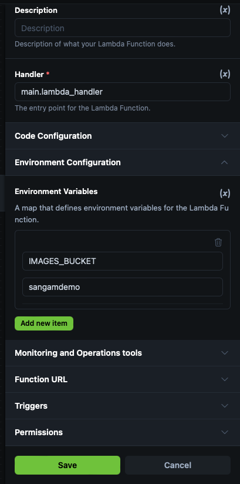
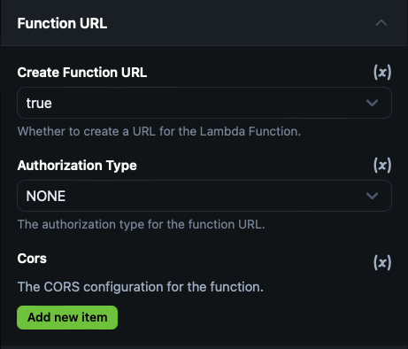

<a href="https://appCD.com"></a>
<a href="https://docs.appCD.io/getting-started"></a>


### Hello Kitty 

> add hello kitty repo link 

```
https://github.com/appcd-demo/hello-kitty
make build 
app.zip
```


### analyze this repo 


> Click on `hello-kitty-function` 

add filename `app.zip` 
set function url as `true`





click on save 

### add s3 bucket name same by clicking on s3 bucket topology


Click on save 
### Download the IaC


### create terraform folder and unzip and add to terraform folder 


```
(base) ➜ makdir terraform 
(base) ➜ cd terraform 
(base) ➜  terraform git:(main) ✗ ls

README.md         modules           outputs.tf        terraform.tfstate images 
main.zip          modules.tf.json   provider.tf       variables.tf

```
#### apply your AWS credentials 

```
export AWS_ACCESS_KEY_ID 
export AWS_SECRET_ACCESS_KEY
export AWS_SESSION_TOKEN
```
### Terraform init 

```
terraform init
Initializing the backend...
Initializing modules...
```
### Terraform plan 

```
 terraform plan
var.region
  AWS region in which the project needs to be setup (us-east-1, ca-west-1, eu-west-3, etc)

  Enter a value: us-east-1

```

### terraform apply 

```
terraform apply 
var.region
  AWS region in which the project needs to be setup (us-east-1, ca-west-1, eu-west-3, etc)

  Enter a value: us-east-1

  Outputs:

aws_cloudwatch_log_group_aws_lambda_hello_kitty_function_arn = "arn:aws:logs:us-east-1:438465137822:log-group:/aws/lambda/hello-kitty-function"
aws_cloudwatch_log_group_aws_lambda_hello_kitty_function_name = "/aws/lambda/hello-kitty-function"
aws_iam_role_hello_kitty_role_arn = "arn:aws:iam::438465137822:role/hello-kitty-role"
aws_iam_role_hello_kitty_role_name = "hello-kitty-role"
aws_lambda_hello_kitty_function_function_arn = "arn:aws:lambda:us-east-1:438465137822:function:hello-kitty-function"
aws_lambda_hello_kitty_function_function_name = "hello-kitty-function"
aws_lambda_hello_kitty_function_function_url = "https://6uag2rfrygwafcsv4w6ihazmte0mcrbs.lambda-url.us-east-1.on.aws/"
aws_lambda_hello_kitty_function_invoke_arn = "arn:aws:apigateway:us-east-1:lambda:path/2015-03-31/functions/arn:aws:lambda:us-east-1:438465137822:function:hello-kitty-function/invocations"
aws_s3_sangamdemo_arn = "arn:aws:s3:::sangamdemo"
aws_s3_sangamdemo_bucket_name = "sangamdemo"
aws_s3_sangamdemo_kms_arn = "arn:aws:kms:us-east-1:438465137822:key/983e66cb-73d4-4a0b-9535-f613dd2a37b4"

```


### add images to S3 bucket 
you will find the bucket name here 

aws_s3_sangamdemo_bucket_name = "sangamdemo"


```
aws s3 cp images/ s3://<your-bucket-name>/ --recursive
```


### check your Function URL 

> https://6uag2rfrygwafcsv4w6ihazmte0mcrbs.lambda-url.us-east-1.on.aws/


### Terraform destroy 

```
terraform destroy
var.region
  AWS region in which the project needs to be setup (us-east-1, ca-west-1, eu-west-3, etc)

  Enter a value: us-east-1 
