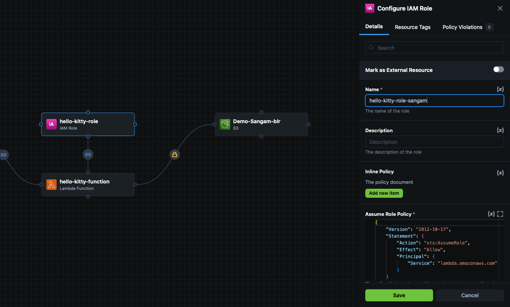

 

### Hello Kitty 

login to your github account 

open following link 

 https://github.com/appcd-demo/hello-kitty

click on fork button select your account 


> add hello kitty repo link 

```
curl -sL https://git.io/_has | bash -s terraform aws git zip unzip python3
apt install zip
git clone https://github.com/appcd-demo/hello-kitty
cd hello-kitty
make build 
app.zip
```
login to [cloud.stackgen.com](https://cloud.stackgen.com/)

To get the AWS Lambda setup we need, we’ll use StackGen’s infrastructure from code capability to generate the IaC we need for speedy deployment.

To run StackGen, we are going to:
Log in.
Create an appStack from our hello kitty code repository, and
Get our topology.
Log in
First, log in to cloud.appcd.io. If you don’t have an account, you can easily log in with your GitHub, GitLab, Google, or BitBucket credentials.


### analyze this repo 


> Click on `hello-kitty-function` 

add filename `app.zip` 

change function name should be unique for all 


add Environment Variables
set function url as `true`

click on save 

### add s3 bucket name same by clicking on s3 bucket topology


click on save 

## change name hello-kitty role should be unique 



## change name of cloud watch log group should be unique


### export iac locally 


### go to your killerKoda sandbox and click on Editor tab 

now you see your file directory 

left click and you will see this option to upload file 


### upload generated tf to build folder 


```

(base) ➜  build ✗ ls

README.md         modules           outputs.tf        terraform.tfstate images 
app.zip          modules.tf.json   provider.tf       variables.tf

```
#### apply your AWS credentials 

```
export AWS_ACCESS_KEY_ID 
export AWS_SECRET_ACCESS_KEY
export AWS_SESSION_TOKEN
```
### Terraform init 

```
terraform init
Initializing the backend...
Initializing modules...
```
### Terraform plan 

```
 terraform plan
var.region
  AWS region in which the project needs to be setup (us-east-1, ca-west-1, eu-west-3, etc)

  Enter a value: us-east-1

```

### terraform apply 

```
terraform apply 
var.region
  AWS region in which the project needs to be setup (us-east-1, ca-west-1, eu-west-3, etc)

  Enter a value: us-east-1

  Outputs:

aws_cloudwatch_log_group_aws_lambda_hello_kitty_function_arn = "arn:aws:logs:us-east-1:438465137822:log-group:/aws/lambda/hello-kitty-function"
aws_cloudwatch_log_group_aws_lambda_hello_kitty_function_name = "/aws/lambda/hello-kitty-function"
aws_iam_role_hello_kitty_role_arn = "arn:aws:iam::438465137822:role/hello-kitty-role"
aws_iam_role_hello_kitty_role_name = "hello-kitty-role"
aws_lambda_hello_kitty_function_function_arn = "arn:aws:lambda:us-east-1:438465137822:function:hello-kitty-function"
aws_lambda_hello_kitty_function_function_name = "hello-kitty-function"
aws_lambda_hello_kitty_function_function_url = "https://6uag2rfrygwafcsv4w6ihazmte0mcrbs.lambda-url.us-east-1.on.aws/"
aws_lambda_hello_kitty_function_invoke_arn = "arn:aws:apigateway:us-east-1:lambda:path/2015-03-31/functions/arn:aws:lambda:us-east-1:438465137822:function:hello-kitty-function/invocations"
aws_s3_sangamdemo_arn = "arn:aws:s3:::sangamdemo"
aws_s3_sangamdemo_bucket_name = "sangamdemo"
aws_s3_sangamdemo_kms_arn = "arn:aws:kms:us-east-1:438465137822:key/983e66cb-73d4-4a0b-9535-f613dd2a37b4"

```


### add images to S3 bucket 
you will find the bucket name here 

aws_s3_sangamdemo_bucket_name = "sangamdemo"


```
aws s3 cp images/ s3://<your-bucket-name>/ --recursive
```


### check your Function URL 

> https://6uag2rfrygwafcsv4w6ihazmte0mcrbs.lambda-url.us-east-1.on.aws/


### Terraform destroy 

```
terraform destroy
var.region
  AWS region in which the project needs to be setup (us-east-1, ca-west-1, eu-west-3, etc)

  Enter a value: us-east-1 
